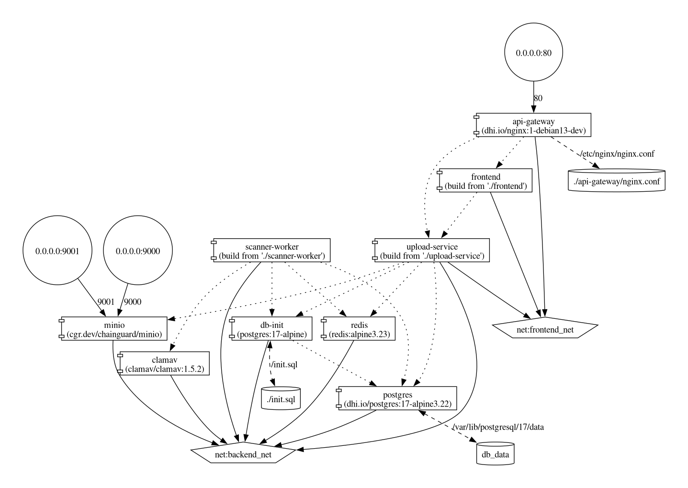
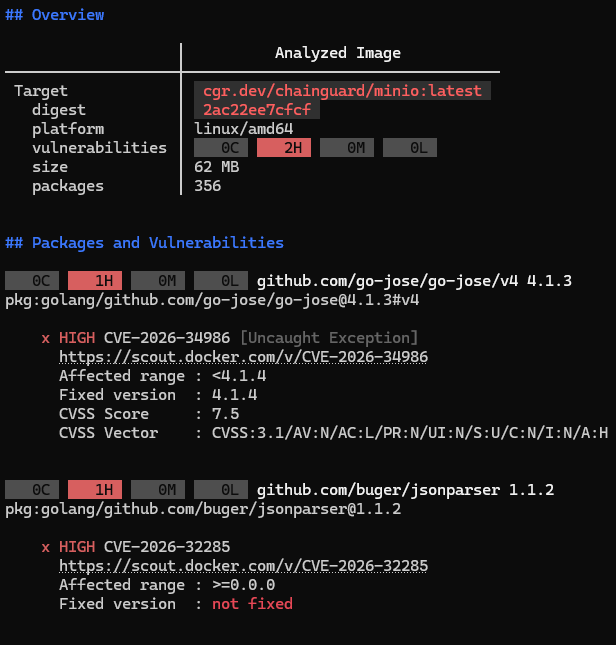
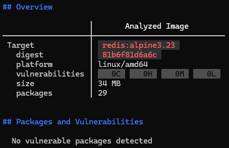
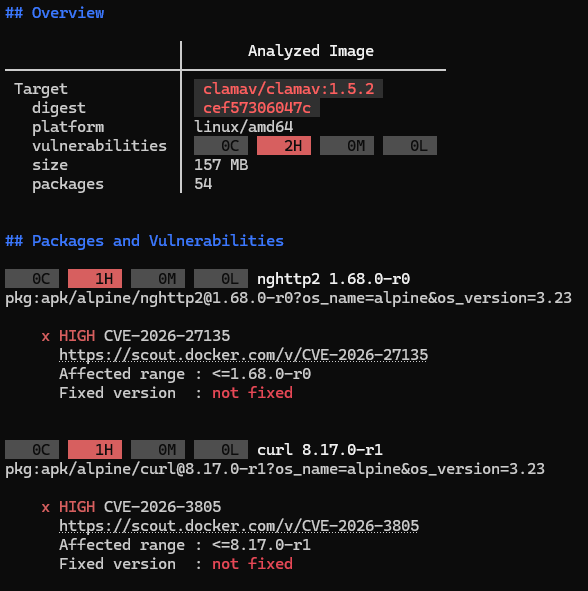
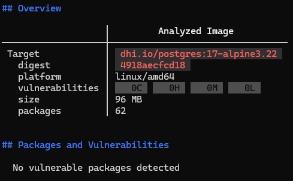

# Project for the CI/CD Process Security course

## Overview


SecuScan is a microservices-based application designed to allow users to upload files for scanning to detect potential threats. This project is structured into several microservices, each responsible for a specific aspect of the application.

## Microservices



- [API Gateway](./api-gateway/README.md): Manages requests and routes them to the appropriate microservices.
- [Frontend](./frontend/README.md): The user interface of the application, built with React and Vite.
- [Scanner Worker](./scanner-worker/README.md): Handles background tasks related to scanning and processing data.
- [Upload Service](./upload-service/README.md): Manages file uploads and related operations.
- **minIO**: A high-performance, S3-compatible object storage server used for securely storing uploaded files before and during the scanning process.
- **Redis**: Acts as a message broker and task queue, enabling reliable asynchronous communication between the Upload Service and the Scanner Worker.
- **ClamAV**: The core antivirus engine responsible for inspecting uploaded files and detecting potential malware or malicious threats.
- **Database (Postgresql)**: Stores persistent application data, including file metadata, current scan statuses, and historical security results.

There were also plans to create an Auth microservice, but after consulting with the course instructor, it was deemed unnecessary in light of the project's requirements and was omitted.

As for the microservices for which custom Dockerfiles were not written, appropriate images were selected from the Docker Hub registry, and the necessary configuration was implemented in the docker-compose.yaml file. The choice of image was primarily guided by the absence of vulnerabilities. For the minIO and PostgreSQL images, we chose the hardened versions provided by Chainguard and Docker (Docker Hardened Images).
In case of minIO, this solution has the drawback of requiring the use of the `latest` tag - selecting specific versions is not available for free. Therefore, if you wish to deploy our application in production, you should keep in mind that using this image would incur costs. The problem stems from the original creator abandoning the project - in that case, as alternative you can use a fork-based image, though it is not marked as an official image in the Docker Hub registry.

Regarding PostgreSQL, to properly initialize the database, we have defined an init container that is designed to send SQL code to the target database - this is necessary because the hardened PostgreSQL image does not automatically run the scripts located in _/docker-entrypoint-initdb.d/_.

### Safety of minIO image



As we can see in the screenshot above, despite the hardening, the image is not free of vulnerabilities. Nevertheless, this does not pose a significant threat to our application.

- CVE-2026-34986

Vulnerability in the Go cryptography library. Attempting to decrypt a maliciously crafted JWE object using specific algorithms and an empty key field causes a memory allocation error and a process crash. In our application, MinIO is not exposed to the public - only trusted microservices from within the private Docker network communicate with it, which completely prevents a potential attacker from sending a malicious token.

- CVE-2026-32285

The function responsible for removing items based on a JSON payload does not correctly validate offsets when it receives a corrupted or non-standard JSON file. This leads to a reference to a negative memory index and an immediate process crash. In the case of our application, the lack of direct access to MinIO from the public Internet prevents an attacker from injecting a malformed JSON payload to cause a crash.

### Safety of Redis image



As we can see on the screenshot above, this image is free of vulnerabilities.

### Safety of ClamAV image



This is a case similar to the one described [here](./frontend/README.md).

### Safety of PostgreSQL image



As we can see on the screenshot above, this image is free of vulnerabilities.

## Getting Started

To get started with the project, follow the steps below:

1. Clone the repository:

   ```bash
   git clone https://github.com/SaWyyy/SecuScan
   cd SecuScan
   ```

2. Set up variables in _.env_ file.

3. Launch it using Docker Compose:

   ```bash
   docker compose up
   ```

4. The application is available at `localhost:80`
