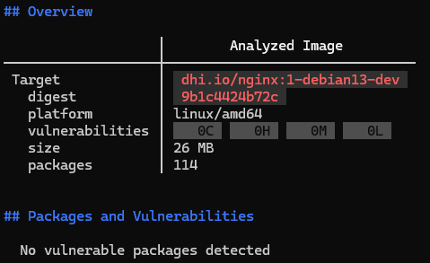

# API Gateway

## Overview

The API Gateway (powered by Nginx) is responsible for managing requests from clients and routing them to the appropriate services. It acts as a single entry point for the entire application.

## Features

- **Request Routing:** Directs incoming traffic based on URL paths:
  - `/` -> Routes to the Frontend application.
  - `/api/` -> Routes to the Upload Service.
- **Rate Limiting:** Protects the API endpoints from abuse and DDoS attacks by restricting traffic to 5 requests per second (with a allowed burst of 10 requests).
- **Security Headers:** Automatically injects security headers (`X-Frame-Options`, `X-Content-Type-Options`, `X-XSS-Protection`) to mitigate common web vulnerabilities like Clickjacking and XSS.
- **Payload Size Restriction:** Limits the maximum allowed size of a client request body to 15MB to control upload sizes and prevent server overload.
- **IP Forwarding:** Preserves the client's original IP address and Host headers when passing requests to backend services.

## Docker image

For the API gateway, a pre-built Nginx image (a hardened version available as part of Docker Hardened Images) was used, with the relevant parameters configured in the docker-compose.yaml file. Choosing this image allowed us to avoid critical and high-severity vulnerabilities present in the standard images provided by Nginx (as shown in the screenshot as of April 4, 2026).

