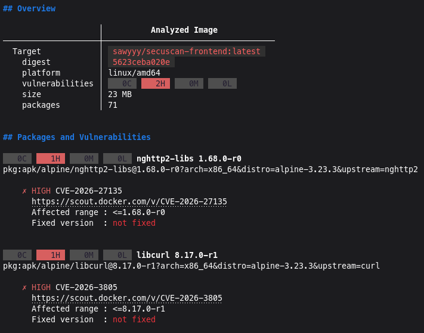

# Frontend

## Overview

The Frontend is built using React and Vite, providing a modern, responsive user interface for the SecuScan platform. It allows users to easily upload files for security scanning and monitor the results in real-time.

## Features

- **Drag & Drop Upload Interface:** Intuitive file upload zone with visual feedback for drag-and-drop actions, supporting files up to 15MB.
- **Real-Time Result Polling:** Automatically fetches scan results from the API every 3 seconds to keep the audit log up to date without manual page refreshes.
- **Dynamic Audit Log:** Displays a comprehensive list of scanned files, including:
  - Filenames and unique IDs.
  - Threat detection details (if infected).
  - Color-coded status badges (CLEAN, INFECTED, SCANNING, PENDING) with animations.
- **Microservices Status Dashboard:** Provides a quick visual overview of the system's health, including the API Gateway, ClamAV Engine, and MinIO Storage.

## Docker image

A Dockerfile has been defined for the frontend microservice, which contains two stages: the first builds the application, and the second runs the built application using Nginx. An Nginx image was used that runs processes without root privileges, which improves the security of the service.

The image built using the aforementioned Dockerfile was pushed to the [Docker Hub registry](https://hub.docker.com/r/sawyyy/secuscan-frontend).

Below is a screenshot showing the scan results (as of April 4, 2026) for the specified image, generated by Docker Scout:

The detected security vulnerabilities affect system tools and libraries in the base image (nginxinc/nginx-unprivileged:alpine), and Docker Scout does not indicate a version that would address these vulnerabilities; however, given the architecture in use, they do not constitute an exploitable attack vector.

- CVE-2026-27135

The vulnerability stems from a state validation error when processing malformed HTTP/2 frames. In our architecture, the frontend container is isolated from the public Internet by the API Gateway. The gateway fully terminates external traffic, and requests forwarded to the frontend container via the `proxy_pass` directive are handled internally using the HTTP/1.x protocol. Since the frontend container does not directly receive external HTTP/2 traffic, the nghttp2 library is not used in a manner vulnerable to this attack.

- CVE-2026-3805

The vulnerability in the curl tool is triggered only when reconnecting to the same host using the SMB protocol. The frontend service functions solely as a static file server and does not initiate any outbound SMB requests in any business or technical processes. The presence of the curl package in the image is entirely passive, meaning there is no execution path necessary to trigger this vulnerability.
