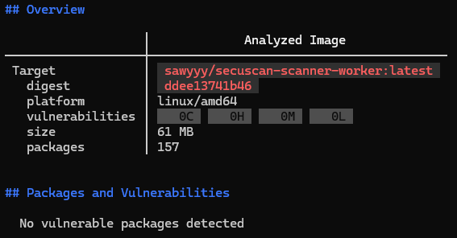

# Scanner Worker

## Overview

The Scanner Worker is a core asynchronous background service responsible for orchestrating the malware scanning process within the SecuScan platform. It acts as the bridge between the message broker, object storage, the antivirus engine, and the primary database.

## Features

- **Asynchronous Task Queueing:** Continuously listens to a Redis queue (`scan_queue`) using blocking pop operations to process new file uploads immediately as they arrive.
- **In-Memory Streaming:** Fetches files securely from MinIO and streams them directly into the ClamAV engine over a network socket, avoiding unnecessary writes to local disk.
- **Real-Time State Management:** Updates the scanning lifecycle statuses (`SCANNING`, `CLEAN`, `INFECTED`, `ERROR`) and specific threat signatures (virus names) directly in the PostgreSQL database.
- **Automated Cleanup:** Automatically deletes the original files from the MinIO `uploads` bucket once the scan is complete, ensuring storage optimization and security.
- **Fault Tolerance & Logging:** Implements comprehensive `try-except` blocks and structural logging to gracefully handle missing files, database connection drops, or engine timeouts without crashing the worker loop.

## Docker image

A Dockerfile has been created for this service to run the Python application after its dependencies have been satisfied. In addition, certain dependencies are being updated to prevent vulnerabilities from occurring. A non-root user is also used to enhance security.

The image built using the aforementioned Dockerfile was pushed to the [Docker Hub registry](https://hub.docker.com/r/sawyyy/secuscan-scanner-worker).

Below is a screenshot from the Docker Scout tool:

