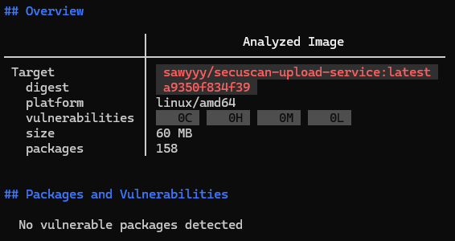

# Upload Service

## Overview

The Upload Service serves as the primary entry point for the SecuScan platform's backend operations. It handles file uploads from the client, stores them securely, initiates the asynchronous scanning pipeline, and provides data for the frontend's real-time audit log.

## Features

- **File Ingestion (`POST /api/upload`):** - Accepts file uploads via `multipart/form-data`.
  - Assigns a unique UUID to every uploaded file to prevent naming collisions.
  - Efficiently writes the file directly to the MinIO `uploads` bucket using optimal chunk sizes (10MB parts).
- **Asynchronous Task Delegation:** After saving the file and logging the initial `PENDING` state to the database, the service pushes a task payload (containing the file ID and name) to the Redis `scan_queue`. This allows the API to return a success response to the user immediately, without waiting for the actual ClamAV scan to finish.
- **Data Serving (`GET /api/results`):** Provides a read-only endpoint that queries the PostgreSQL database to retrieve the 20 most recent scan records (ordered by creation time). This directly powers the frontend's automatic polling mechanism.
- **Automated Infrastructure Initialization:** Utilizes FastAPI's startup events (`@app.on_event("startup")`) to automatically verify and create the required `uploads` bucket in MinIO upon service boot, preventing runtime storage errors.
- **CORS Management:** Implements Cross-Origin Resource Sharing (CORS) middleware to securely allow incoming requests from the frontend application regardless of the hosting domain or port.
- **Graceful Error Handling:** Wraps external calls (MinIO, PostgreSQL, Redis) in explicit `try-except` blocks, returning appropriate `500 Internal Server Error` HTTP exceptions with descriptive details if any part of the infrastructure fails.

## Docker image

A Dockerfile has been created for this service to run the Python application after its dependencies have been satisfied. A non-root user is also used to enhance security.

The image built using the aforementioned Dockerfile was pushed to the [Docker Hub registry](https://hub.docker.com/r/sawyyy/secuscan-upload-service).

Below is a screenshot from the Docker Scout tool:

